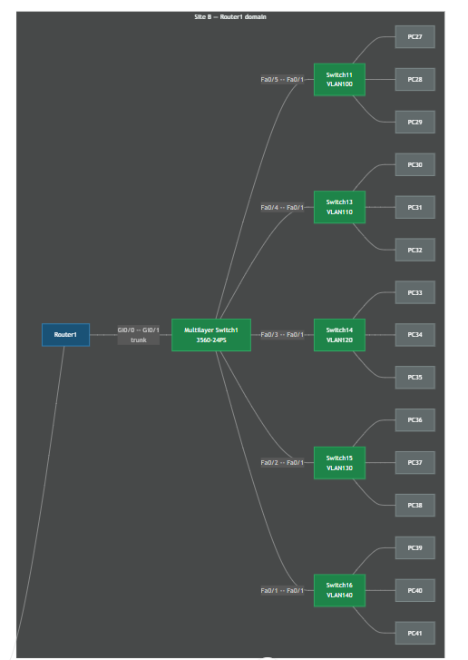
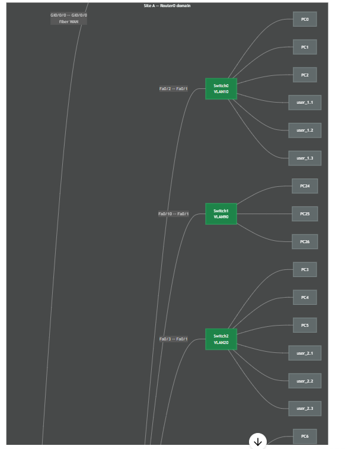
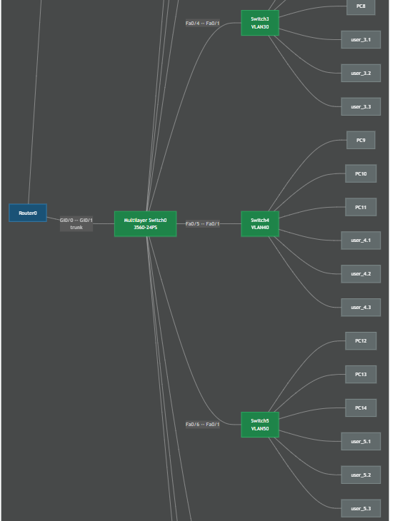
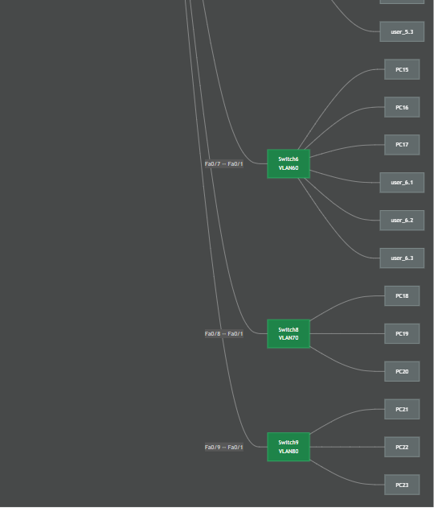

# Enterprise-Network-Cisco-Architecture
Advanced enterprise-grade dual-site network architecture with robust Inter-VLAN routing and firewall security definitions.
# 🌐 Enterprise Network Infrastructure & Advanced Security Design
**Course:** ICT 2206 – Internet Programming (Individual Project)  
**University:** Rajarata University of Sri Lanka (Department of Computing)  

## 👤 Student Profile
* **Name:** S.R.D.M.S. Mahindasena
* **Registration No:** ICT/2021/068
* **Index No:** 5227


## 🗺️ Visual Network Topology & Packet Tracer Simulations
Below are the production screenshots capturing the endpoint connectivity layouts, logical distribution segments, and routing domains across the entire corporate network infrastructure:

### 1️⃣ Core Enterprise Layout (Overview)


### 2️⃣ Multi-Department Endpoint Distribution (Site A & Site B Topology)


### 3️⃣ Gateway Configuration & Router Interfaces


### 4️⃣ Active Host Connectivity Framework


---

## 🗺️ Interactive Structural Map
```mermaid
flowchart LR
    classDef router fill:#1a5276,stroke:#3498db,color:#fff
    classDef switch fill:#1e8449,stroke:#2ecc71,color:#fff
    classDef host fill:#616a6b,stroke:#95a5a6,color:#fff

    subgraph Site_A["Site A — Router0 Domain (Campus LAN)"]
        Router0["🎛️ Core Router 0<br/>(2911)"]:::router
        MLS0["🔌 Multilayer Switch 0<br/>3560-24PS"]:::switch
        SW0["🔌 Switch 0<br/>VLAN 10 (user1)"]:::switch
        SW2["🔌 Switch 2<br/>VLAN 20 (user2)"]:::switch
        SW3["🔌 Switch 3<br/>VLAN 30 (user3)"]:::switch
        SW4["🔌 Switch 4<br/>VLAN 40 (user4)"]:::switch
        SW5["🔌 Switch 5<br/>VLAN 50 (user5)"]:::switch
        SW6["🔌 Switch 6<br/>VLAN 60 (user6)"]:::switch
        SW8["🔌 Switch 8<br/>VLAN 70 (user7)"]:::switch
        SW9["🔌 Switch 9<br/>VLAN 80 (user8)"]:::switch
        SW1["🔌 Switch 1<br/>VLAN 90 (user9)"]:::switch

        u11["💻 User 1.1"]:::host
        u12["💻 User 1.2"]:::host
        u13["💻 User 1.3"]:::host
        u21["💻 User 2.1"]:::host
        u22["💻 User 2.2"]:::host
        u23["💻 User 2.3"]:::host
        u31["💻 User 3.1"]:::host
        u32["💻 User 3.2"]:::host
        u33["💻 User 3.3"]:::host
    end

    subgraph Site_B["Site B — Router1 Domain (Data Center / HQ)"]
        Router1["🎛️ Router 1<br/>(Edge Gateway)"]:::router
        MLS1["🔌 Multilayer Switch 1<br/>3560-24PS"]:::switch
        SW11["🔌 Switch 11<br/>VLAN 100 (user10)"]:::switch
        SW13["🔌 Switch 13<br/>VLAN 110 (user11)"]:::switch
        SW14["🔌 Switch 14<br/>VLAN 120 (user12)"]:::switch
        SW15["🔌 Switch 15<br/>VLAN 130 (user13)"]:::switch
        SW16["🔌 Switch 16<br/>VLAN 140 (user14)"]:::switch
    end

    %% Core WAN Links
    Router0 === |"Gi0/0/0 -- Gi0/0/0<br/>Fiber WAN Link"| Router1
    Router0 --- |"Gi0/0 -- Gi0/1<br/>Inter-VLAN Trunk"| MLS0
    MLS0 --- |"Fa0/2"| SW0
    MLS0 --- |"Fa0/3"| SW2
    MLS0 --- |"Fa0/4"| SW3
    SW0 --- u11 & u12 & u13
    SW2 --- u21 & u22 & u23

    Router1 --- |"Gi0/0 -- Gi0/1<br/>Trunk"| MLS1
    MLS1 --- |"Fa0/5"| SW11
    MLS1 --- |"Fa0/4"| SW13

🛠️ Infrastructure Implementation Highlights 

1. Dual-Site Enterprise Routing Architecture
Site A (Local Campus): Managed by Router 0 via Inter-VLAN routing templates for user segments mapping from VLAN 10 up to VLAN 90.

Site B (Central Data Center): Deployed Router 1 tracking foundational networks spanning from VLAN 100 to VLAN 140.

Backbone Connectivity: Bridged the structural sites using dedicated physical Fiber WAN encapsulation rules.

2. Traffic Flow Hardening via Advanced Extended ACLs
Anti-Reconnaissance Constraints: Implemented strict filter regulations across logical gateways to prevent targeted network sniffing (blocking untrusted outbound/inbound ICMP Echo-Requests while allowing valid local operational Echo-Replies).

DHCP Ecosystem Safety: Maintained critical system paths for UDP bootstrap ports 67 and 68 so endpoints can safely fetch dynamic ip leases without disruption.

Verified Deployment Command Snippets
Core Inter-VLAN Sub-Interface Pruning

Router# configure terminal
Router(config)# no ip access-list extended 100
Router(config)# interface gig0/0.10
Router(config-subif)# no ip access-group 100 in

Static Next-Hop Enterprise Mapping
Router(config)# ip route 192.168.140.0 255.255.255.0 200.120.10.1
Router(config)# ip route 192.168.100.0 255.255.255.0 200.120.10.1
